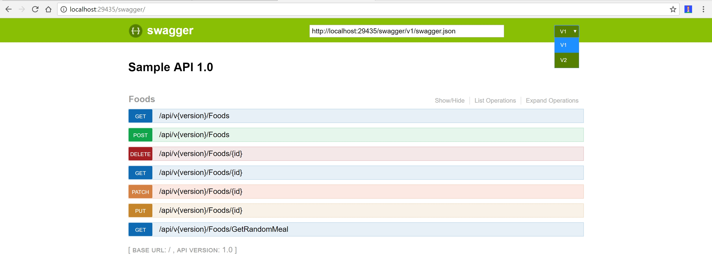
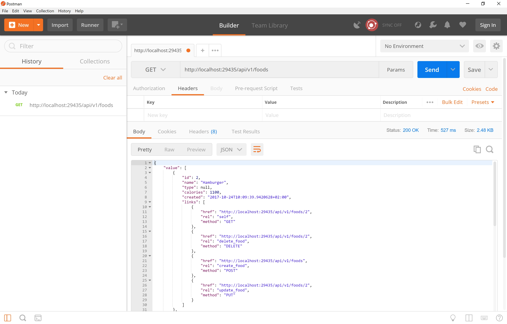
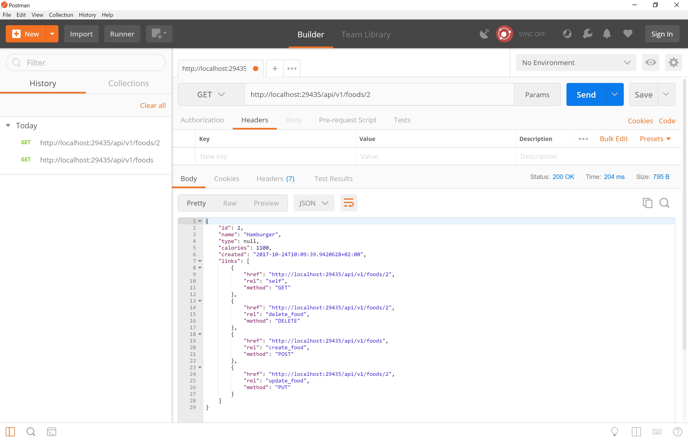
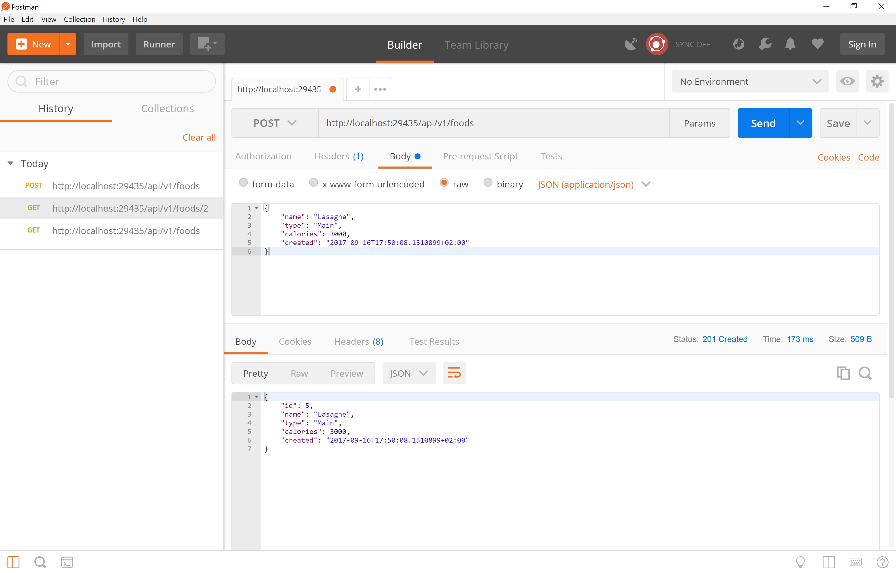
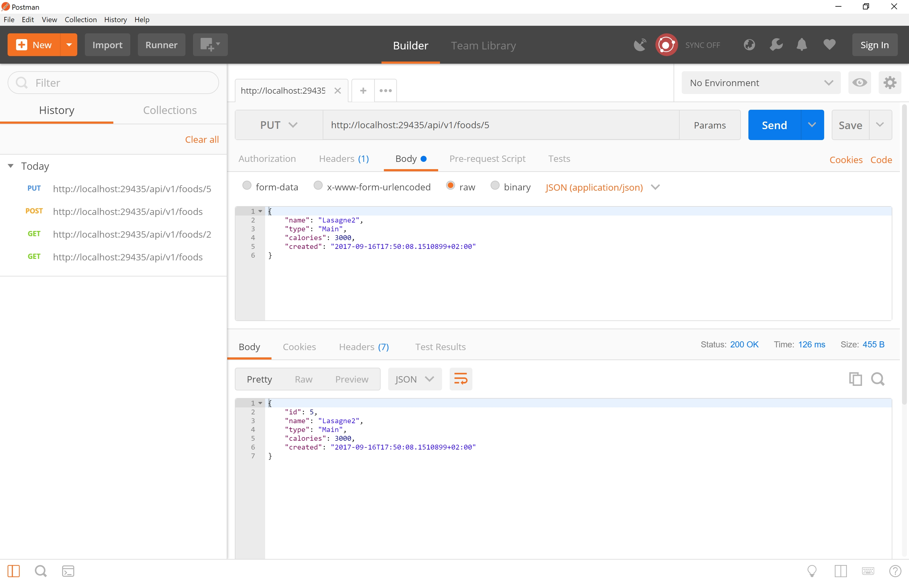
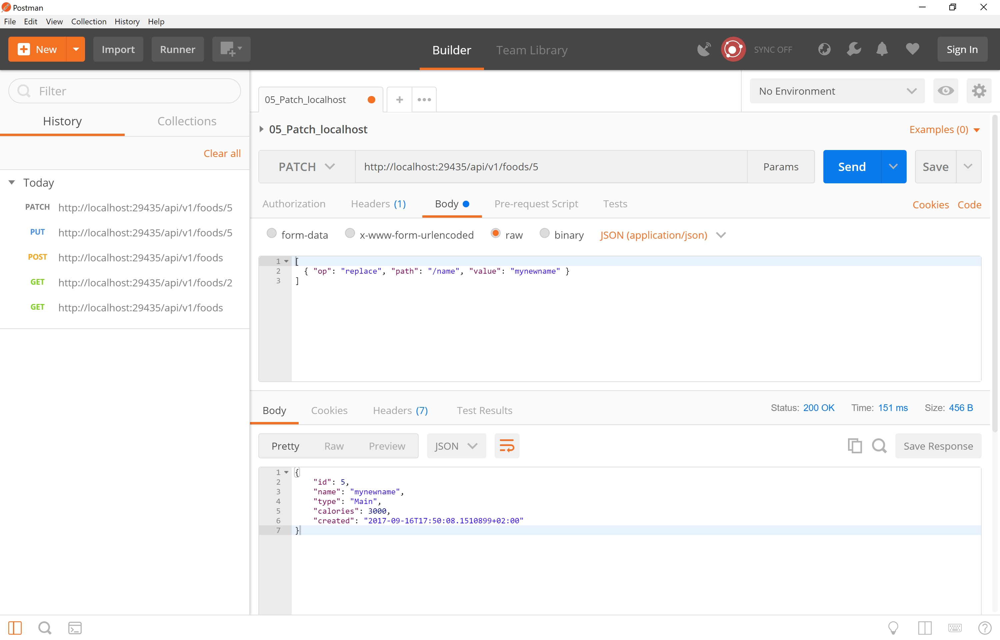
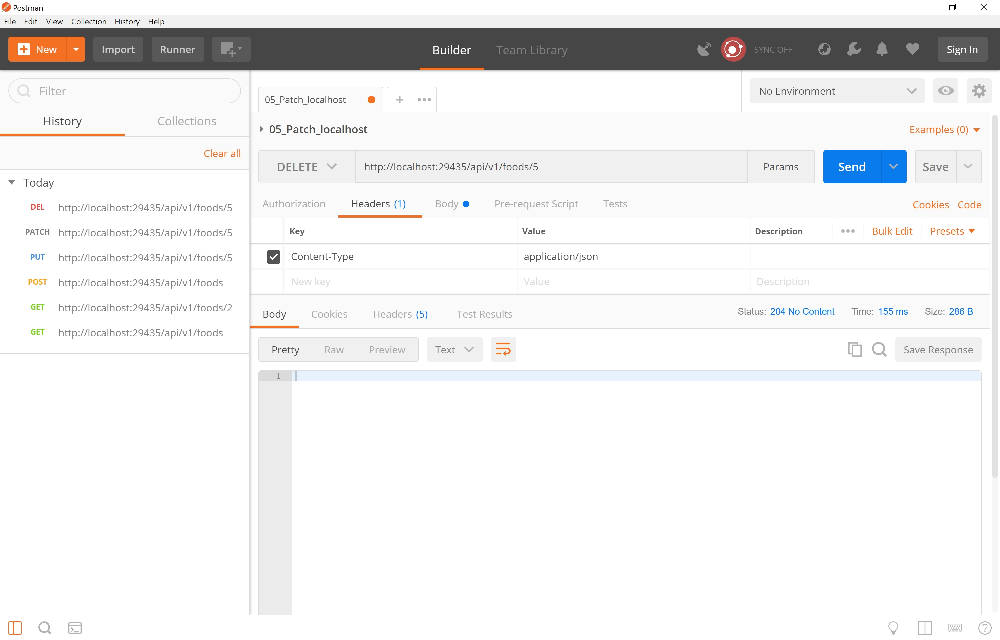

# ASP.NET Core WebApi Sample with HATEOAS, Versioning & Swagger

In this repository I want to give a plain starting point at how to build a WebAPI with ASP.NET Core.

This repository contains a controller which is dealing with FoodItems. You can GET/POST/PUT/PATCH and DELETE them.

Hope this helps.

See the examples here: 

## Versions

``` http://localhost:29435/swagger ```



## GET all Foods

``` http://localhost:29435/api/v1/foods ```



## GET single food

``` http://localhost:29435/api/v1/foods/2 ```



## POST a foodItem

``` http://localhost:29435/api/v1/foods ```

```javascript
  {
      "name": "Lasagne",
      "type": "Main",
      "calories": 3000,
      "created": "2017-09-16T17:50:08.1510899+02:00"
  }
```



## PUT a foodItem

``` http://localhost:29435/api/v1/foods/5 ```

``` javascript
{
    "name": "Lasagne2",
    "type": "Main",
    "calories": 3000,
    "created": "2017-09-16T17:50:08.1510899+02:00"
}
```




## PATCH a foodItem

``` http://localhost:29435/api/v1/foods/5 ```

``` javascript
[
  { "op": "replace", "path": "/name", "value": "mynewname" }
]
```



## DELETE a foodItem

``` http://localhost:29435/api/v1/foods/5 ```



