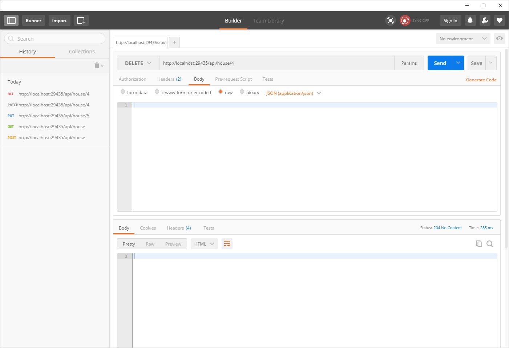

# ASP.NET Core WebApi Sample

In this repository I want to give a plain starting point at how to build a WebAPI with ASP.NET Core.

This repository contains a controller which is dealing with houses. You can GET/POST/PUT/PATCH and DELETE them.

Hope this helps.

See the examples here: 

## GET all houses

``` http://localhost:29435/api/house ```


## GET single house

``` http://localhost:29435/api/house/1 ```


## POST a house

``` http://localhost:29435/api/house ```

````javascript
  {
    "street": "MyNewStreet",
    "city": "MyHomeTown",
    "zipCode": 1234
  }
```


## PUT a house

``` http://localhost:29435/api/house/5 ```

````javascript
{
    "id": 5,
    "street": "HAAALELUJAH",
    "city": "HAAALELUJAH-TOWN",
    "zipCode": 1234657
}
```


## PATCH a house

``` http://localhost:29435/api/house/4 ```

````javascript
[
    { "op": "replace", "path": "/street", "value": "PatchStreet" }
]
```


## DELETE a house

``` http://localhost:29435/api/house ```



